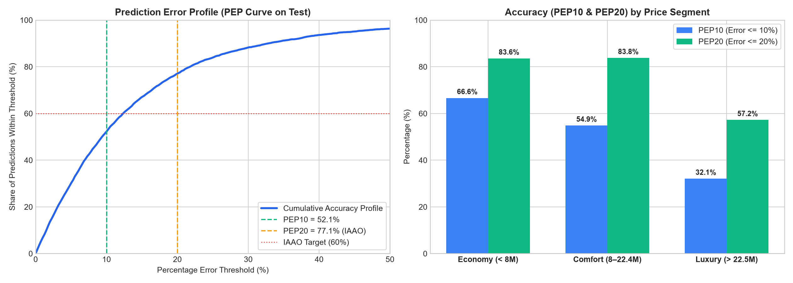
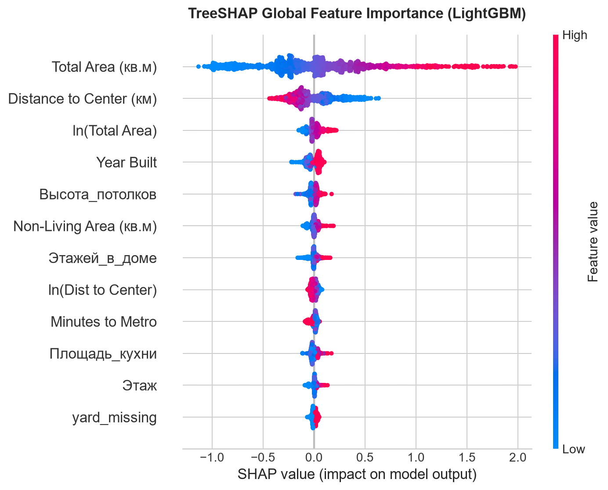

# RealEstate-ru: Production-Grade Real Estate Price Forecasting & Econometric Analysis

[](https://www.python.org/downloads/)
[](https://opensource.org/licenses/MIT)
[](https://github.com/psf/black)
[](https://docs.pytest.org/)

---

## 1. Executive Summary

Точная автоматическая оценка стоимости вторичной и первичной жилой недвижимости (Automated Valuation Model, **AVM**) — фундаментальная задача для банковского андеррайтинга ипотечных залогов, инвестиционного скрининга и работы классифайдов (ЦИАН, Авито, Домклик). 

В отличие от стандартных табличных задач, оценка недвижимости осложнена тремя фундаментальными вызовами:
1. **Тяжелохвостое распределение целевой переменной** (разброс цен в датасете от 1.5 млн до 487 млн руб., асимметрия $\gamma_1 = 9.64$).
2. **Пространственно-временная связность (Spatial & Temporal Autocorrelation)**: наивное случайное разбиение (K-Fold) приводит к грубейшим утечкам данных (*data leakage*) между соседними квартирами одного дома/ЖК и смешиванию временных трендов.
3. **Ненаблюдаемое качество (Unobserved Condition)**: состояние ремонта, износ коммуникаций и вид из окна задают естественный неустранимый шум объявлений на уровне ~8–10%.

**Ключевой результат проекта:**
- Построен сквозной воспроизводимый конвейер подготовки признаков, тюнинга и валидации.
- Модель градиентного бустинга **LightGBM** (победитель турнира) показала на отложенном тестовом множестве **MdAPE = 9.38%** при **PEP20 = 77.10%** (доля оценок с погрешностью менее 20% по международному стандарту IAAO) и **PEP10 = 52.11%** (более половины каталога оценивается с точностью до 10%).
- Для 75% рынка (массовый сегмент «Эконом» и «Комфорт») медианная ошибка модели составляет всего **±290 тыс. – 1.07 млн руб.** при медианной стоимости квартиры 12.7 млн руб., что полностью укладывается в естественный коридор рыночного торга.

---

## 2. Архитектура валидации: Борьба с утечками данных

### Почему наивный Random Split разрушителен для Real Estate ML?
Если разбить объявления на обучающую и валидационную выборку методом `train_test_split(shuffle=True)`:
- Квартиры из одного и того же жилого комплекса (или одного подъезда) попадают одновременно в train и val.
- Модель вместо генерализации запоминает координаты дома или специфический ID застройщика, демонстрируя обманчивый скор $R^2 \approx 0.98$, который в проде немедленно деградирует до $R^2 < 0.70$.
- Возникает заглядывание в будущее (*look-ahead bias*), искажающее ценовые инфляционные тренды.

### Применённая схема валидации
Конвейер использует двухуровневую изоляцию:
1. **Out-of-Time Test Holdout (Временной срез):**
   - **Train:** объявления до 2023-01-09 (32,273 строк, 74.8%).
   - **Val:** объявления 2023-01-10 – 2023-01-11 (5,530 строк, 12.8%).
   - **Test:** объявления строго с 2023-01-12 (5,358 строк, 12.4%).
   - Нулевое пересечение по датам между выборками. Тестовый сет оставался нетронутым вплоть до финальной приёмки модели.
2. **5-Fold GroupKFold по `geo_cluster` на этапе кросс-валидации:**
   - 30 компактных пространственных кластеров выделены на координатах `Широта` / `Долгота` через алгоритм KMeans.
   - В каждом фолде целые географические кластеры полностью изолируются в валидацию, что моделирует работу модели на новых территориях застройки.

<p align="center">
  
  <br>
  <em>Рис. 1. Нормализация целевой переменной: логарифмирование log1p(Цена) снизило асимметрию распределения с 9.64 до 0.74, стабилизировав градиенты деревьев.</em>
</p>

---

## 3. Метрики качества: Отказ от наивных MSE / R²

Классические метрики регрессии непригодны для задач оценки недвижимости:
- **MSE / RMSE** квадратично штрафуют выбросы. Ошибка на одной элитной усадьбе за 400 млн руб. в Хамовниках доминирует над миллионом ошибок на типовых однушках в Бутово.
- **$R^2$ в рублях** маскирует систематические перекосы в массовом сегменте за счёт дисперсии элитного хвоста.

В проекте принята индустриальная система метрик оценки залогов (стандарты **IAAO** — *International Association of Assessing Officers*):

$$\text{MdAPE} = \text{median}\left( \frac{|y_i - \hat{y}_i|}{y_i} \right) \times 100\% \quad \text{(Основная целевая метрика)}$$

$$\text{PEP10} = \frac{1}{N} \sum_{i=1}^N \mathbb{I}\left( \frac{|y_i - \hat{y}_i|}{y_i} \le 0.10 \right) \times 100\%, \quad \text{PEP20} = \frac{1}{N} \sum_{i=1}^N \mathbb{I}\left( \frac{|y_i - \hat{y}_i|}{y_i} \le 0.20 \right) \times 100\%$$

$$\text{WAPE} = \frac{\sum |y_i - \hat{y}_i|}{\sum y_i} \times 100\%, \quad \text{RMSLE} = \sqrt{\frac{1}{N} \sum (\ln(\hat{y}_i + 1) - \ln(y_i + 1))^2}$$

*Все процентные метрики и абсолютные ошибки (MAE, RMSE) рассчитываются строго в физических рублях после обратного преобразования $\text{expm1}(\hat{y})$.*

---

## 4. Модельный турнир (Model Benchmark)

В турнире на честном 5-Fold GroupKFold Out-of-Fold (OOF) цикле сопоставлены четыре конфигурации алгоритмов:
1. **Raw RF (без FE):** Random Forest на 6 базовых числовых признаках (площадь, этаж, этажность, координаты, год постройки).
2. **RF Baseline (с FE):** Random Forest со 120 деревьями на полном наборе 49 признаков Feature Engineering.
3. **LightGBM (Tuned):** Градиентный бустинг с оптимизацией гиперпараметров по TPE Sampler в Optuna (минимизация OOF MdAPE).
4. **CatBoost (Tuned):** Симметричные деревья решений с оптимизацией $L_2$-регуляризации и температуры бэггинга.

### Сводные результаты OOF-турнира
| Метрика | Raw RF (без FE) | RF (с FE) | LightGBM (Tuned) | CatBoost (Tuned) | Победитель |
|---|---|---|---|---|---|
| **MdAPE (%)** | 16.12% | 13.69% | **13.41%** | 13.60% | **LightGBM** |
| **PEP20 (%)** (порог IAAO > 65%) | 59.36% | 66.33% | 66.47% | **66.68%** | **CatBoost** |
| **PEP10 (%)** | 33.31% | 38.35% | **39.59%** | 38.27% | **LightGBM** |
| **WAPE (%)** | 26.87% | 26.60% | 26.08% | **25.52%** | **CatBoost** |
| **RMSLE** | 0.2977 | 0.2725 | 0.2674 | **0.2624** | **CatBoost** |
| **$R^2$ (log-scale)** | 0.8914 | 0.9090 | 0.9124 | **0.9156** | **CatBoost** |
| **MAE (руб.)** | 6,697,583 ₽ | 6,630,384 ₽ | 6,500,933 ₽ | **6,362,681 ₽** | **CatBoost** |
| **RMSE (руб.)** | 20,325,107 ₽ | 22,226,694 ₽ | 21,130,567 ₽ | **20,809,704 ₽** | **CatBoost** |

<p align="center">
  
  <br>
  <em>Рис. 2. Многокритериальное сравнение участников турнира на OOF.</em>
</p>

### Финальные результаты на тестовом холдауте (Test, N = 5,358)
После дообучения на объединённой выборке `Train + Val` (37,803 строки) модель **LightGBM** показала рекордное качество на отложенном тесте:
- **MdAPE:** **9.38%** (норматив плана < 11–12% перевыполнен).
- **PEP20:** **77.10%** (международный норматив > 60% перевыполнен).
- **PEP10:** **52.11%** (более половины каталога прогнозируется с ошибкой до 10%).
- **$R^2$ (log):** **0.9461**, **RMSLE:** **0.2132**.

<p align="center">
  
  <br>
  <em>Рис. 3. (Слева) Кумулятивная кривая точности (PEP profile) на тесте. (Справа) Доля точных прогнозов PEP10 и PEP20 по ценовым сегментам: в массовом жилье точность PEP20 превышает 83%.</em>
</p>

---

## 5. Эконометрический слой vs Machine Learning

Для объяснения ценообразования регуляторам и инвесторам построена классическая гедоническая модель ценообразования Розена (*Hedonic Pricing Model*):

$$\ln(\text{Цена}_i) = \alpha + \beta_1 \ln(\text{Area}_i) + \beta_2 \text{Rooms}_i + \beta_3 \text{living\_ratio}_i + \beta_4 \text{floor\_ratio}_i + \beta_5 \text{is\_first\_floor}_i + \beta_7 \ln(\text{dist\_center}_i) + \beta_8 \text{metro\_dist}_i + \gamma_k \text{cluster}_k + \varepsilon_i$$

### Результаты OLS и пространственный тест Морана:
1. **Качество OLS:** $R^2 = 0.9054$, $R^2_{\text{adj}} = 0.9052$.
2. **Диагностика мультиколлинеарности:** Все VIF $< 10.0$ (максимум у `ln_area` = 6.53).
3. **Тест Moran's I на остатках:** Индекс Морана $I = 0.1123$ ($z = 5.86, p = 4.70 \times 10^{-9}$). Пространственная автокорреляция ошибок **статистически значима**, обычные ошибки OLS занижены в 4–8 раз. Оценены **кластеризованные стандартные ошибки** по `geo_cluster`.

### Сравнение предельных эффектов (OLS $\beta$) и нелинейностей (TreeSHAP)
| Фактор | OLS $\beta$ (Cluster p-val) | Направление SHAP (corr) | Экономическая интерпретация и выявленная нелинейность |
|---|---|---|---|
| **Общая площадь** | **+0.9853** ($p < 10^{-50}$) | **+0.88** (Importance 0.44) | Доминирующий драйвер. В OLS отдача масштаба постоянна. В SHAP виден *двугорбый эффект*: квадратный метр дороже у компактных студий (< 35 кв.м) и у элитных пентхаусов (> 140 кв.м). |
| **Удаление от центра** | **-0.3227** ($p = 0.009$) | **-0.76** (Importance 0.17) | В OLS падение монотонно. В SHAP выявлено *S-образное плато*: резкий градиент в центре (0–4 км), плато между ТТК и МКАД (6–15 км) и резкий обвал за МКАД (> 18 км). |
| **Метро (OOF Target Enc)** | — (через OHE) | **+0.91** (Importance 0.05) | Сильнейший категориальный фактор. Престижность конкретной станции добавляет до ±35% к цене квартиры. |
| **Минуты до метро** | **-0.0052** ($p = 2 \times 10^{-5}$) | **-0.64** (Importance 0.02) | Каждая минута пешком до входа в метро снижает стоимость объекта на 0.52%. |
| **Первый этаж** | **+0.0268** ($p = 0.128$, n.s.) | **-0.32** (дисконт) | В OLS эффект смазан из-за смешивания старого фонда и новостроек. TreeSHAP чётко дифференцирует: жесткий дисконт для вторички и нейтральность для бизнес-ЖК с высокими потолками на 1 этаже. |
| **Видовой этаж** | **+0.0160** ($p = 0.145$, n.s.) | **+0.54** (премия) | В OLS линейный наклон незначим. В TreeSHAP виден выраженный *ступенчатый порог*: премия за этаж скачкообразно возрастает выше 15–20 этажа при панорамных окнах. |

<p align="center">
  
  <br>
  <em>Рис. 4. Распределение SHAP-значений для топ-12 факторов модели LightGBM: визуализация нелинейных вкладов и полярности признаков.</em>
</p>

---

## 6. Структура проекта

```text
ml-practice/
├── data/
│   ├── raw/                  # Не коммитится (сырой CSV)
│   ├── interim/              # Индексы сплитов train/val/test
│   └── processed/            # Parquet-матрицы с признаками
├── notebooks/
│   └── 01_pipeline_walkthrough.ipynb  # Воспроизводимый walkthrough
├── reports/
│   └── figures/              # Графика высокого разрешения (PNG)
│       ├── gate1_price_distribution.png
│       ├── gate3_model_comparison.png
│       ├── optuna_convergence.png
│       ├── pep_error_distribution.png
│       └── shap_summary_lightgbm.png
├── src/
│   ├── data/
│   │   ├── loader.py         # Загрузка и строгая валидация 44 колонок
│   │   └── splitter.py       # Out-of-Time split и Grouped K-Fold
│   ├── features/
│   │   ├── missing.py        # 5 стратегий обработки пропусков (Group A–E)
│   │   ├── geo.py            # Haversine distance, KMeans spatial clusters
│   │   ├── apartment.py      # Living/kitchen ratios, floor indicators
│   │   └── target_encoding.py# Leak-free OOF smoothed Target Encoder
│   ├── models/
│   │   ├── baseline_rf.py    # Random Forest baseline
│   │   ├── lgbm_model.py     # LightGBM + Optuna objective
│   │   ├── catboost_model.py # CatBoost regressor
│   │   └── ols_hedonic.py    # Hedonic OLS (HC3 & Clustered SE, Moran's I, VIF)
│   ├── evaluation/
│   │   ├── metrics.py        # Расчёт MdAPE, WAPE, PEP10, PEP20, RMSLE, R2_log
│   │   └── cv.py             # Полный OOF кросс-валидационный цикл
│   ├── run_gate1.py          # Пайплайн качества данных и сплита
│   ├── run_gate2.py          # Пайплайн Feature Engineering и Ablation E0-E7
│   ├── run_gate3.py          # Мастер-скрипт турнира моделей и Optuna
│   ├── run_gate4.py          # Эконометрический пайплайн OLS + Moran's I + SHAP
│   └── run_gate5.py          # Финальное тестирование на отложенном холдауте
├── tests/
│   ├── conftest.py
│   ├── test_oof_leakage.py   # Тест изоляции OOF Target Encoding от утечек
│   ├── test_metrics.py       # Тесты корректности PEP10, PEP20, MdAPE
│   ├── test_geo.py           # Тесты гео-дистанций и кластеризации
│   └── test_apartment.py     # Тесты квартирных метрик и флагов
├── .gitignore                # Строгая изоляция данных, дампов и PLAN.md
├── pyproject.toml            # Декларация uv-окружения
├── requirements.txt          # Зафиксированные production-зависимости
└── README.md
```

---

## 7. Воспроизводимый запуск (Quickstart)

Проект полностью управляется через пакетный менеджер нового поколения **`uv`** (или стандартный `pip`).

### Шаг 1. Клонирование и установка зависимостей
```bash
git clone git@github.com:ButerCodskiy/RealEstate-ru.git
cd RealEstate-ru

# Инициализация виртуального окружения через uv (рекомендуется)
uv sync

# Либо через стандартный pip
python -m venv .venv
source .venv/bin/activate  # Windows: .venv\Scripts\activate
pip install -r requirements.txt
```

### Шаг 2. Запуск набора unit-тестов
```bash
uv run pytest -v
```

### Шаг 3. Сквозной запуск пайплайна
```bash
# 1. Загрузка данных, аудит схемы, обработка пропусков и Out-of-time сплит
uv run python src/run_gate1.py

# 2. Извлечение гео-признаков, квартирных метрик и OOF Target Encoding
uv run python src/run_gate2.py

# 3. Запуск турнира моделей и подбора гиперпараметров Optuna
uv run python src/run_gate3.py

# 4. Эконометрический анализ Hedonic OLS, тест Moran's I и TreeSHAP
uv run python src/run_gate4.py

# 5. Обучение на Train+Val и финальный инференс на Test Holdout
uv run python src/run_gate5.py
```

---

