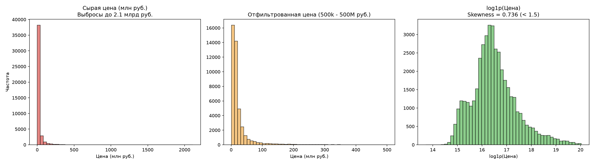

# Gate 1 — Отчёт по качеству данных и сплиту (Data Quality & Split Report)

> **Дата генерации:** 2026-09-21  
> **Статус:** Completed (Готов к ревью)  
> **Исходный датасет:** `C:\Users\Дмитрий\ml-practice\data\raw\houseprices.csv` (43 256 строк, 44 колонки)

---

## 1. Фильтрация целевой переменной и качество данных

По результатам аудита выявлены записи с фиктивными ценами (например, `Цена = 1 рубль`), а также сверхвыбросы.
Установлены строгие пороги фильтрации в `src/config.py`: `min_price = 500,000 руб.` и `max_price = 500,000,000 руб.`

| Показатель | Исходный датасет (Raw) | Отфильтрованный (Clean) | Изменение |
|---|---|---|---|
| Количество записей | 43,256 | 43,161 | -95 (-0.22%) |
| Мин. цена | 1 руб. | 900,000 руб. | Мусор < 500k отфильтрован |
| Макс. цена | 2,112,193,000 руб. | 500,000,000 руб. | Выбросы > 500M отфильтрованы |
| Средняя цена | — | 24,793,206 руб. | — |
| Медианная цена | — | 13,316,400 руб. | — |
| Skewness (Цена) | 9.642 | 5.314 | Значительное снижение асимметрии |
| **Skewness log1p(Цена)** | — | **0.736** | **Критерий выполнен (< 1.5)** |
| Kurtosis log1p(Цена) | — | 0.877 | Нормализованный эксцесс |

---

## 2. Схема временного сплита (Temporal Split)

Для исключения заглядывания в будущее (Data Leakage) применён строгий временной сплит по колонке `Дата`:
- **Train (обучение):** `Дата <= 2023-01-09`
- **Validation (валидация):** `2023-01-09 < Дата <= 2023-01-11`
- **Test Holdout (финальный контроль):** `Дата > 2023-01-11`

| Выборка | Интервал дат | Количество строк | Доля | Минимальный критерий | Статус |
|---|---|---|---|---|---|
| **Train** | `2022-02-26` — `2023-01-09` | **32,273** | 74.8% | ≥ 30 000 строк | **PASS** |
| **Validation** | `2023-01-10` — `2023-01-11` | **5,530** | 12.8% | — | **PASS** |
| **Test Holdout** | `2023-01-12` — `2023-01-20` | **5,358** | 12.4% | ≥ 3 000 строк | **PASS** |
| **Итого** | `2022-02-26` — `2023-01-20` | **43,161** | 100.0% | — | — |

> [!NOTE]
> Индексы выборок зафиксированы в локальных файлах: `data/interim/train_idx.parquet`, `data/interim/val_idx.parquet`, `data/interim/test_idx.parquet`.

---

## 3. Аудит пропусков и стратегия обработки (Groups A–E)

| Колонка | Пропусков (число) | Пропусков (%) | Группа | Стратегия обработки | Статус |
|---|---|---|---|---|---|
| `Запланирован_снос` | 42,908 | 99.2% | Группа E | Удалена (99.2% пропусков) | Обработано |
| `Тёплый_пол` | 41,373 | 95.6% | Группа E | Удалена (95.6% пропусков, шум) | Обработано |
| `Техника` | 36,882 | 85.3% | Группа A | Флаг has_appliances_mentioned + 'Не указано' | Обработано |
| `Мебель` | 35,657 | 82.4% | Группа A | Флаг is_furnished_mentioned + 'Не указано' | Обработано |
| `Корпус_строение` | 34,212 | 79.1% | Группа C | 'Не указан' | Обработано |
| `Отделка` | 32,595 | 75.4% | Группа A | Флаг otdelka_missing + 'Не указана' | Обработано |
| `Тип_участия` | 32,258 | 74.6% | Группа C | 'Не указан' для вторички | Обработано |
| `Срок_сдачи` | 32,258 | 74.6% | Группа C | months_to_delivery = Срок_сдачи - Дата; NaN -> 0 | Обработано |
| `Официальный_застройщик` | 32,258 | 74.6% | Группа C | 'secondary_market' для вторички | Обработано |
| `Название_новостройки` | 32,256 | 74.6% | Группа C | Флаг is_new_building; OOF target encoding в Gate 2 | Обработано |
| `В_доме` | 28,585 | 66.1% | Группа D | Нативный NaN для градиентного бустинга | Обработано |
| `Грузовой_лифт` | 24,621 | 56.9% | Группа B | Парсинг + 0 при отсутствии | Обработано |
| `Балкон_или_лоджия` | 24,050 | 55.6% | Группа A | Флаг balcony_missing + 'Не указан' | Обработано |
| `Вид_сделки` | 23,405 | 54.1% | Группа D | Нативный NaN для градиентного бустинга | Обработано |
| `Год_постройки` | 23,115 | 53.4% | Группа A | Флаг year_built_missing + медиана по Тип_дома | Обработано |
| `Двор` | 21,961 | 50.8% | Группа A | Флаг yard_missing + 'Не указан' | Обработано |
| `Парковка` | 21,234 | 49.1% | Группа A | Флаг parking_missing + 'Не указана' | Обработано |
| `Высота_потолков` | 20,855 | 48.2% | Группа A | Флаг ceiling_missing + парсинг + медиана по Тип_дома | Обработано |
| `Тип_комнат` | 18,942 | 43.8% | Группа D | Нативный NaN для градиентного бустинга | Обработано |
| `Пассажирский_лифт` | 17,434 | 40.3% | Группа B | Парсинг + 0 при отсутствии / этажей <= 5 | Обработано |
| `Окна` | 17,362 | 40.1% | Группа D | Нативный NaN для градиентного бустинга | Обработано |
| `Жилая_площадь` | 12,883 | 29.8% | Группа A | Флаг living_area_missing + групповая медиана по train | Обработано |
| `Ремонт` | 11,702 | 27.1% | Группа A | Флаг repair_missing + 'Не указан' | Обработано |
| `Способ_продажи` | 10,329 | 23.9% | Группа D | Нативный NaN для градиентного бустинга | Обработано |
| `Площадь_кухни` | 9,404 | 21.7% | Группа A | Флаг kitchen_missing + групповая медиана по train | Обработано |
| `Санузел` | 8,080 | 18.7% | Группа D | Нативный NaN для градиентного бустинга | Обработано |
| `Расстояние_до_метро_3` | 3,021 | 7.0% | Группа D | Нативный NaN для градиентного бустинга | Обработано |
| `Метро_1` | 2,772 | 6.4% | Группа D | Нативный NaN для градиентного бустинга | Обработано |
| `Расстояние_до_метро_2` | 2,579 | 6.0% | Группа D | Нативный NaN для градиентного бустинга | Обработано |
| `Расстояние_до_метро_1` | 2,247 | 5.2% | Группа D | Нативный NaN для градиентного бустинга | Обработано |
| `Метро_3` | 544 | 1.3% | Группа D | Нативный NaN для градиентного бустинга | Обработано |
| `Метро_2` | 383 | 0.9% | Группа D | Нативный NaN для градиентного бустинга | Обработано |
| `Этажей_в_доме` | 13 | 0.0% | Полный признак | 0% пропусков, используется напрямую | Полный |
| `Общая_площадь` | 13 | 0.0% | Полный признак | 0% пропусков, используется напрямую | Полный |
| `Количество_комнат` | 13 | 0.0% | Полный признак | 0% пропусков, используется напрямую | Полный |
| `Этаж` | 13 | 0.0% | Полный признак | 0% пропусков, используется напрямую | Полный |
| `Тип_дома` | 13 | 0.0% | Полный признак | 0% пропусков, используется напрямую | Полный |
| `Адрес` | 0 | 0.0% | Группа E | Удалена (текстовый адрес, есть Широта/Долгота) | Обработано |
| `Цена` | 0 | 0.0% | Полный признак | 0% пропусков, используется напрямую | Полный |
| `Дата` | 0 | 0.0% | Полный признак | 0% пропусков, используется напрямую | Полный |
| `ID` | 0 | 0.0% | Группа E | Удалена (неинформативный идентификатор) | Обработано |
| `Ссылка` | 0 | 0.0% | Группа E | Удалена (URL объявления) | Обработано |
| `Широта` | 0 | 0.0% | Полный признак | 0% пропусков, используется напрямую | Полный |
| `Долгота` | 0 | 0.0% | Полный признак | 0% пропусков, используется напрямую | Полный |

### Ключевые результаты обработки пропусков:
1. **Нулевая потеря строк:** ни одна запись не была удалена из-за наличия пропусков.
2. **Исключение утечек (No Leakage):** все сгруппированные медианы (`Жилая_площадь`, `Площадь_кухни`, `Высота_потолков`, `Год_постройки`) вычислены исключительно на обучающей выборке (`train_df`).
3. **Выделены флаги `is_missing`:** создано 12 явных индикаторов пропусков и новостроек, несущих доменный сигнал.
4. **Группа E (мусорные признаки) удалена:** `ID`, `Ссылка`, `Адрес`, `Тёплый_пол` (95.6% NaN), `Запланирован_снос` (99.2% NaN).

---

## 4. Чеклист приёмки Gate 1 (Acceptance Criteria)

- [x] `uv init` выполнен; `pyproject.toml` и `uv.lock` существуют и закоммичены.
- [x] `.gitignore` создан и исключает все `data/`, `*.pkl`, `*.csv`, `.venv/`.
- [x] `loader.py` валидирует 44 входных колонки без исключения.
- [x] `skewness(log1p(Цена)) = 0.736 < 1.5` на отфильтрованной выборке.
- [x] `min(Цена_filtered) = 900,000 >= 500 000 руб.`
- [x] `test`-холдаут строго изолирован по датам (`Дата > 2023-01-11`), пересечений с `train` нет.
- [x] Размеры: `train = 32,273` (≥ 30 000), `test = 5,358` (≥ 3 000).
- [x] Все `is_missing` флаги созданы; ни одна запись не дропнута из-за пропуска.
- [x] `data/interim/{train,val,test}_idx.parquet` записаны локально.
- [x] `reports/gate1_data_quality.md` содержит гистограмму, таблицу пропусков и схему сплита.

---
### Рекомендация к переходу на Gate 2 (Feature Engineering)
Фундамент данных полностью очищен, схема валидации зафиксирована, утечки исключены. Все критерии Gate 1 выполнены.
