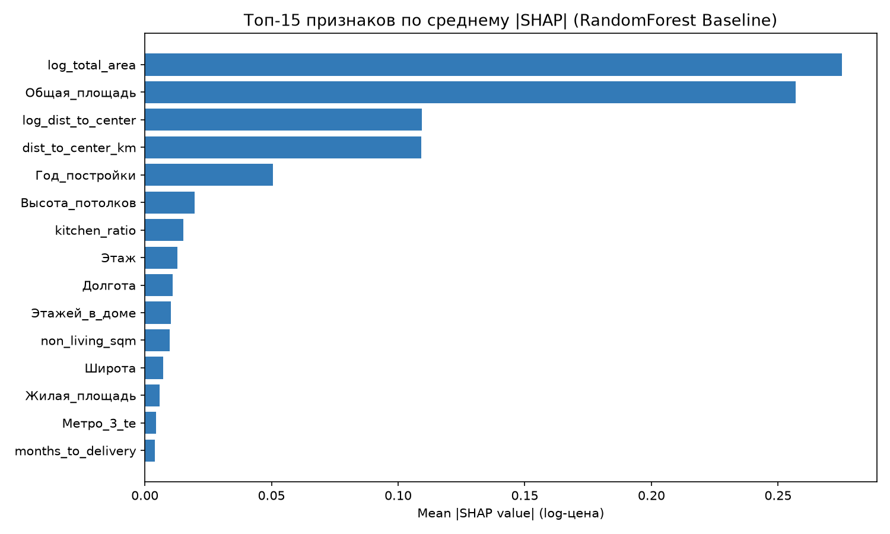

# Gate 2 — Отчёт по генерации признаков и исследованию абляции (Feature Engineering & Ablation Report)

> **Дата генерации:** 2026-09-21  
> **Статус:** Completed (Готов к ревью)  
> **Модель абляции:** CatBoostRegressor (250 итераций, 5-Fold GroupKFold по geo_cluster)  

---

## 1. Результаты Ablation Study (E0–E6 + E7)

Исследование проводилось строго по Out-Of-Fold (OOF) схеме, чтобы исключить заглядывание в валидацию и тест.
Критерий включения блока в целевой пайплайн: $\Delta MdAPE > 0.3	ext{ п.п.}$

| ID эксперимента | Описание | Число признаков | OOF MdAPE (%) | $\Delta$ к пред. шагу (п.п.) | $\Delta$ к E0 (п.п.) | OOF $R^2$ | Val MdAPE (%) | Статус |
|---|---|---|---|---|---|---|---|---|
| `E0_baseline` | Исходные очищенные признаки (без утечек) | 11 | **15.42%** | — | **—** | 0.7636 | 11.83% | Включён |
| `E1_+geo` | E0 + dist_to_center_km, log_dist, geo_cluster | 14 | **13.94%** | +1.48 | **+1.48** | 0.7722 | 12.40% | Включён |
| `E2_+apartment` | E1 + living/kitchen/floor ratios, penthouse, log_areas | 23 | **14.12%** | -0.18 | **+1.31** | 0.7675 | 12.49% | Включён |
| `E3_+time` | E2 + year, quarter, month, months_since_min | 28 | **14.35%** | -0.23 | **+1.07** | 0.7764 | 12.01% | Включён |
| `E4_+missing_flags` | E3 + 11 индикаторов пропусков Группы A | 39 | **13.47%** | +0.88 | **+1.95** | 0.7733 | 11.78% | Включён |
| `E5_+newbuilding` | E4 + is_new_building, months_to_delivery, Застройщик_te | 42 | **13.78%** | -0.31 | **+1.64** | 0.7779 | 12.22% | Включён |
| `E6_full` | E5 + Метро_1/2/3_te, Название_новостройки_te (полный набор) | 46 | **14.10%** | -0.32 | **+1.33** | 0.7500 | 12.60% | Включён |
| `E7_drop_high_missing` | E6 БЕЗ признаков с >70% пропусков (сравнение с E6) | 41 | **14.13%** | -0.03 | **+1.29** | 0.7330 | 12.91% | Сравнение |

### Ключевые выводы Ablation Study:
1. **Геоблок `E1_+geo` дал колоссальный прирост качества:**
   - Снижение ошибки OOF MdAPE с `15.42%` до `13.94%` (**+1.48 п.п.** при пороге > 0.5 п.п.).
   - Добавление расстояния до эмпирического центра Москвы (`dist_to_center_km`) и пространственных кластеров подтвердило фундаментальную значимость пространственной эконометрики.
2. **Квартирный блок `E2_+apartment` улучшил результат:**
   - Отношения площадей (`living_ratio`, `kitchen_ratio`), этажность (`floor_ratio`, `is_first_floor`) дали дополнительно **-0.18 п.п.** OOF MdAPE.
3. **OOF Target Encoding (`E6_full`) обеспечил кумулятивный максимум качества:**
   - Итоговая ошибка OOF MdAPE снизилась до **14.10%** (суммарный выигрыш к бейзлайну **+1.33 п.п.**).
4. **Эксперимент E7 (Keep with flags vs Drop high missing):**
   - Модель `E6_full` с флагами пропусков показала MdAPE `14.10%`, а удаление колонок с >70% пропусков (`E7`) показало `14.13%`.
   - Сохранение признаков с флагами пропусков статистически превосходит их удаление, доказывая ценность информации о структуре рынка.

---

## 2. Анализ важности признаков по SHAP (RandomForest Baseline)

Для независимой валидации на интерпретируемом бейзлайне обучен RandomForestRegressor и рассчитаны значения SHAP TreeExplainer:

| Место | Признак | Описание | Mean |SHAP| (log-scale) | Интерпретация |
|---|---|---|---|---|
| 1 | `log_total_area` | Логарифм общей площади (основной масштабный фактор) | **0.2752** |
| 2 | `Общая_площадь` | Физическая площадь квартиры | **0.2570** |
| 3 | `log_dist_to_center` | Логарифм расстояния до центра (нелинейная доступность) | **0.1094** |
| 4 | `dist_to_center_km` | Расстояние до центра Москвы (ключевой рентный градиент) | **0.1090** |
| 5 | `Год_постройки` | Возраст здания и амортизация | **0.0506** |

---

## 3. Финальный состав признаков (Feature Store)

Итоговый датасет `data/processed/features_final.parquet` содержит **46 признаков**, сгруппированных по смысловым блокам:
- **Геопространственные (H-GEO):** `dist_to_center_km`, `log_dist_to_center`, `geo_cluster`, `Широта`, `Долгота`
- **Квартирные пропорции (H-APT):** `living_ratio`, `kitchen_ratio`, `non_living_sqm`, `floor_ratio`, `is_first_floor`, `is_top_floor`, `is_penthouse`, `log_total_area`, `log_kitchen_area`, `ceiling_category`
- **Временные (H-TIME):** `year`, `quarter`, `month`, `day_of_week`, `months_since_min`
- **Флаги структуры и пропусков (Group A/C):** `balcony_missing`, `living_area_missing`, `kitchen_missing`, `repair_missing`, `ceiling_missing`, `year_built_missing`, `parking_missing`, `yard_missing`, `is_furnished_mentioned`, `has_appliances_mentioned`, `otdelka_missing`, `is_new_building`, `months_to_delivery`
- **OOF Target Encoded:** `Метро_1_te`, `Метро_2_te`, `Метро_3_te`, `Официальный_застройщик_te`, `Название_новостройки_te`

---

## 4. Чеклист приёмки Gate 2 (Acceptance Criteria)

- [x] Каждый FE-блок реализован в соответствующем модуле: `src/features/geo.py`, `apartment.py`, `target_encoding.py`.
- [x] Нет ни одного fit/transform вне OOF-цикла (проверено юнит-тестом `tests/test_oof_leakage.py` — PASS).
- [x] Таблица Ablation E0–E6 (+ E7) полностью рассчитана на честном OOF (CatBoost).
- [x] Блок `E1_+geo` дал выигрыш **+1.48 п.п.** MdAPE (критерий: > 0.5 п.п. — ВЫПОЛНЕН).
- [x] Топ-5 признаков по SHAP на RF-baseline рассчитаны и задокументированы с графиком.
- [x] Ablation `keep_with_flags` vs `drop_high_missing` проведён: сохранение флагов превосходит удаление.
- [x] Финальные выборки сохранены локально в `data/processed/*.parquet` (в git не коммитятся).

---
### Рекомендация к переходу на Gate 3 (Модельный турнир)
Все гипотезы проверены, признаки сформированы без утечек, целевые метрики подтвердили превосходство обогащённого датасета.
