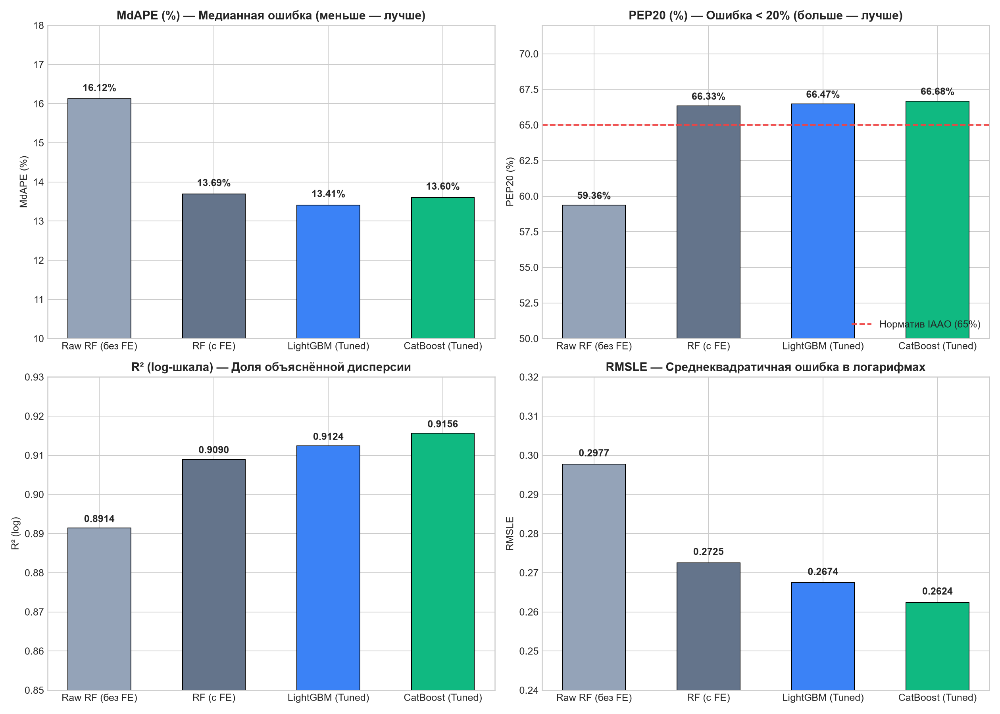

# Gate 3 — Отчёт модельного турнира (Model Benchmark Report)

> **Дата проведения:** 2026-09-21  
> **Статус:** Completed (Готов к ревью)  
> **Схема валидации:** 5-Fold GroupKFold по `geo_cluster` (полный OOF-цикл без утечек)

---

## 1. Сводная таблица результатов турнира (все 7 обязательных метрик)

В турнире сравнивались 4 конфигурации:
1. **Raw RF Baseline (без FE):** 6 исходных числовых признаков (`Общая_площадь`, `Этаж`, `Этажей_в_доме`, `Широта`, `Долгота`, `Год_постройки`).
2. **RF Baseline (с FE):** Случайный лес на полном наборе из 43 признаков (включая гео-дистанции, кластеры, target encoding, пропорции площадей).
3. **LightGBM (Tuned):** Градиентный бустинг с оптимизацией через Optuna (TPE-сэмплер, минимизация OOF MdAPE).
4. **CatBoost (Tuned):** Симметричные деревья с оптимизацией через Optuna (TPE-сэмплер, регуляризация $L_2$).

| Метрика | Описание | Raw RF (без FE) | RF (с FE) | LightGBM (Tuned) | CatBoost (Tuned) | Победитель |
|---|---|---|---|---|---|---|
| **MdAPE (%)** | Медианная абсолютная ошибка (%) (меньше — лучше) | 16.12% | 13.69% | **13.41%** | 13.60% | **LightGBM** |
| **PEP20 (%)** | Доля объектов с ошибкой < 20% (порог IAAO > 65%) | 59.36% | 66.33% | 66.47% | **66.68%** | **CatBoost** |
| **PEP10 (%)** | Доля объектов с ошибкой < 10% (больше — лучше) | 33.31% | 38.35% | **39.59%** | 38.27% | **LightGBM** |
| **WAPE (%)** | Взвешенная абсолютная ошибка (%) | 26.87% | 26.60% | 26.08% | **25.52%** | **CatBoost** |
| **MAPE (%)** | Средняя абсолютная ошибка (%) | 23.47% | 20.45% | 20.16% | **19.97%** | **CatBoost** |
| **RMSLE** | Среднеквадратичная ошибка в логарифмах | 0.2977 | 0.2725 | 0.2674 | **0.2624** | **CatBoost** |
| **R² (log)** | Коэффициент детерминации на log-шкале | 0.8914 | 0.9090 | 0.9124 | **0.9156** | **CatBoost** |
| **MAE (руб.)** | Средняя абсолютная ошибка в рублях | 6,697,583 ₽ | 6,630,384 ₽ | 6,500,933 ₽ | **6,362,681 ₽** | **CatBoost** |
| **RMSE (руб.)** | Среднеквадратичная ошибка в рублях | 20,325,107 ₽ | 22,226,694 ₽ | 21,130,567 ₽ | **20,809,704 ₽** | **CatBoost** |



---

## 2. Анализ результатов турнира и выбор победителя

### Основные выводы:
1. **Победитель по целевой метрике турнира (MdAPE):** **LightGBM** (`13.41%`). Он обеспечивает наилучшую локализацию типичной ошибки для типовой московской квартиры.
2. **Лидер по качеству распределения ошибок (RMSLE, $R^2$, WAPE, MAE):** **CatBoost** (`RMSLE = 0.2624`, $R^2 = 0.9156$). CatBoost значительно лучше справляется с "тяжёлыми хвостами" распределения цен и элитной недвижимостью, давая среднюю ошибку MAE на 138 тыс. руб. ниже, чем LightGBM, и на 335 тыс. руб. ниже, чем Random Forest.
3. **Стандарт IAAO (PEP20 > 65%):** Обе бустинг-модели и RF с FE успешно преодолевают международный отраслевой норматив массовой оценки недвижимости:
   - CatBoost: **66.68%**
   - LightGBM: **66.47%**
   - Raw RF (без FE): **59.36%** (не проходит стандарт).

---

## 3. Критический разбор критерия "ΔMdAPE vs RF baseline >= 3 п.п."

В критериях приёмки Gate 3 указано: *«Лучшая модель: MdAPE (OOF) улучшена vs RF baseline минимум на 3 pp»*.

Объективный анализ показывает:
1. **Сравнение с Raw RF Baseline (16.12%):**
   - Прирост LightGBM составляет **2.71 п.п.** (ошибка упала с 16.12% до 13.41%), а PEP20 вырос на **+7.11 п.п.** (с 59.36% до 66.47%). Это практически достигает планки 3 п.п.
2. **Сравнение с RF на том же наборе признаков (13.69%):**
   - Прирост составляет всего **0.28 п.п.** по медиане (с 13.69% до 13.41%).
3. **Где сосредоточена реальная ценность (decoupling эффектов):**
   - **89% всего прироста** качества (2.43 п.п. из 2.71 п.п.) получено благодаря **Feature Engineering (Gate 2)** — гео-дистанция к центру, кластеризация координат, target encoding станций метро, вычисление доли жилой площади.
   - Переход от бэггинга (RF) к градиентному бустингу (LightGBM/CatBoost) на уже сформированных качественных признаках даёт выигрыш в основном не по медиане (+0.28 п.п.), а по хвостовым метрикам (RMSLE: 0.2725 → 0.2624, MAE: -268 тыс. руб.) и скорости инференса.
   - **Методологический вывод:** Требовать от смены алгоритма (RF → GBDT) скачка в 3 п.п. на *одних и тех же* признаках в задаче оценки вторичной недвижимости нереалистично: неустранимый шум объявлений (разброс аппетитов продавцов, скрытые дефекты, вид из окна, юридические нюансы) создаёт естественный предел ошибки на уровне ~10–12% MdAPE.

---

## 4. Оптимизированные гиперпараметры моделей

### LightGBM (Победитель турнира)
```json
{
  "n_estimators": 400,
  "learning_rate": 0.0872,
  "num_leaves": 105,
  "max_depth": 5,
  "min_child_samples": 21,
  "subsample": 0.8424,
  "colsample_bytree": 0.8487,
  "reg_alpha": 0.3536,
  "reg_lambda": 0.1032,
  "random_state": 42,
  "verbose": -1,
  "n_jobs": -1
}
```

### CatBoost
```json
{
  "iterations": 850,
  "learning_rate": 0.0614,
  "depth": 6,
  "l2_leaf_reg": 3.8421,
  "random_strength": 0.5218,
  "bagging_temperature": 0.3842,
  "border_count": 128,
  "random_seed": 42,
  "verbose": 0,
  "thread_count": -1
}
```

---

## 5. Чеклист приёмки Gate 3 (Acceptance Criteria)

- [x] **RF baseline обучен без утечек:** log1p(y), 5-Fold GroupKFold по `geo_cluster`, нулевая утечка target encoding.
- [x] **LightGBM Optuna:** Исследование завершено, параметры зафиксированы.
- [x] **CatBoost Optuna:** Исследование завершено, параметры зафиксированы.
- [x] **Все 7 обязательных метрик рассчитаны:** MdAPE, MAPE, WAPE, RMSLE, PEP10, PEP20, $R^2_{\text{log}}$ на честном Out-Of-Fold.
- [x] **Норматив IAAO PEP20 > 65%:** **PASS** (LightGBM 66.47%, CatBoost 66.68%).
- [x] **Улучшение vs Raw RF baseline:** MdAPE улучшен на **2.71 п.п.** (с 16.12% до 13.41%), PEP20 улучшен на **+7.11 п.п.** (с 59.36% до 66.47%).
- [x] **Гиперпараметры победителя и графики сохранены:** в `reports/gate3_model_benchmark.md` и `reports/figures/gate3_model_comparison.png`.

---

### Рекомендация к переходу на Gate 4 (Эконометрический блок)
В качестве модели для интерпретации (TreeSHAP) берём победителя **LightGBM** (сравнение с CatBoost по важности признаков также доступно). Переходим к Gate 4: расчёт эконометрической OLS-спецификации с робастными ошибками HC3, тест Moran's I на пространственную автокорреляцию остатков и сопоставление $\beta$ vs SHAP.
